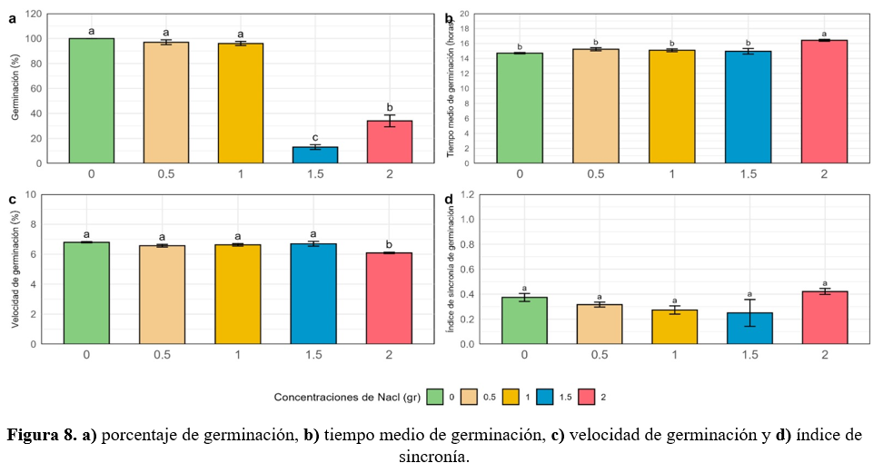
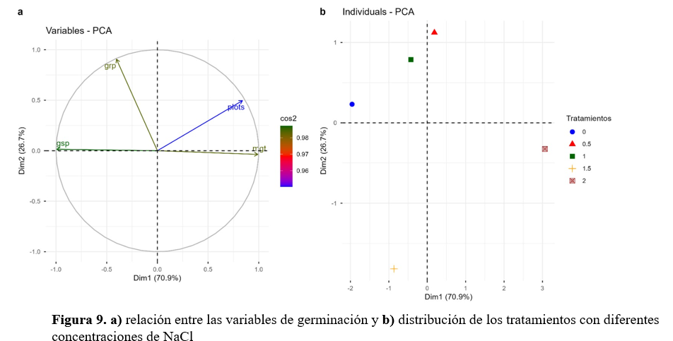

# RESULTADOS

# DISCUSIONES 

⇒ Evaluar el índice de sincronía de germinación
⇒ Los resultados mostraron que la germinación del maíz dependió de la concentración de NaCl. El control, 0.5 y 1.0 g/100 mL presentaron altos porcentajes de germinación, indicando tolerancia a bajas concentraciones salinas (Khalid et al., 2023).

⇒ En cambio, 1.5 y 2.0 g/100 mL redujeron significativamente la germinación. Esto se debe a que el exceso de sales dificulta la absorción de agua y genera estrés osmótico en las semillas (Liang et al., 2018; Shahzad et al., 2019).
La velocidad de germinación disminuyó y el tiempo medio aumentó principalmente en 2.0 g/100 mL. Por ello, la salinidad elevada no solo reduce la germinación, sino que también retrasa el proceso (Khalid et al., 2023).

⇒ El índice de sincronía no presentó diferencias significativas. Sin embargo, el PCA separó los tratamientos de mayor salinidad de aquellos con mejor germinación, confirmando el efecto negativo del NaCl (Ren et al., 2025).
